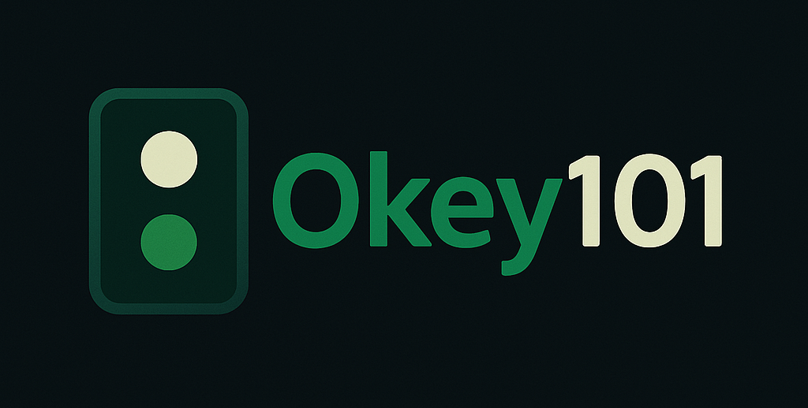

# 🎲 Okey101 – Geliştirilmiş Geleneksel Taş Oyunu

Okey101, tamamen HTML5, CSS ve JavaScript ile oluşturulmuş, geleneksel Türk taş oyunu “Okey 101”in güzel, etkileşimli ve tamamen animasyonlu bir versiyonudur. Bu geliştirilmiş sürüm, akıcı animasyonlar, etkileyici kullanıcı arayüzü, ses efektleri ve modern tarayıcılar için optimize edilmiş duyarlı bir düzen sunar.



## ✨ Özellikler

- 🎨 Pürüzsüz animasyonlar ve görsel efektlerle zarif modern kullanıcı arayüzü
- 🧩 Gerçekçi taş görselleri ve sürükle-bırak etkileşimleri
- 🔊 Taş çekme, atma ve dizme için yerleşik ses efektleri
- 🔁 Hamle geri alma ve oyunu yeniden başlatma desteği
- 📱 Masaüstü ve tabletler için tamamen duyarlı düzen
- 🧠 3 rakip için temel yapay zeka simülasyonu (genişletilebilir)

## 🚀 Başlarken

Herhangi bir modern web tarayıcısında `okey101-enhanced.html` dosyasını açmanız yeterlidir:

```bash
git clone https://github.com/makalin/Okey101
cd Okey101
open index.html
```

## 🕹️ Nasıl Oynanır

1. Çekme veya atma yığınından bir taş çekin.
2. Taşlarınızı geçerli dizilere düzenleyin:
   - **Setler**: Farklı renklerde 3-4 aynı numara
   - **Sıralar**: Aynı renkte 3 veya daha fazla ardışık numara
   - **Jokerler** herhangi bir taşın yerine kullanılabilir.
3. Dizileri onaylayın ve sırayı bitirmek için bir taş atın.

Düğmeleri kullanın:
- 🔄 **Yeni Oyun** – sıfırdan yeniden başlat
- 🧩 **Dizileri Onayla** – taş gruplarını doğrula
- ↩️ **Hamleyi Geri Al** – son işlemi geri al

## 🛠️ Teknoloji Yığını

- Vanilla JavaScript (ES6+)
- HTML5 Canvas ile görüntüleme
- Özel değişkenler ve geçişlerle CSS3
- Google Fonts’tan Poppins yazı tipi

## 📂 Dosya Yapısı

```
Okey101/
├── index.html  # Ana oyun dosyası
├── README.md              # Bu dosya
└── assets/                # (İsteğe bağlı) Görseller, sesler vb.
```

## 📢 Notlar

- Bu yalnızca önyüz sürümüdür ve 4 oyunculu oyunun yerel simülasyonunu içerir.
- Henüz arka uç veya çok oyunculu destek yoktur.
- Katkılar memnuniyetle karşılanır!

## 📄 Lisans

Bu proje MIT Lisansı altında lisanslanmıştır. Ayrıntılar için LICENSE dosyasına bakın.

## İletişim

Sorular, öneriler veya geri bildirimler için lütfen bir konu açmaktan veya iletişime geçmekten çekinmeyin.
